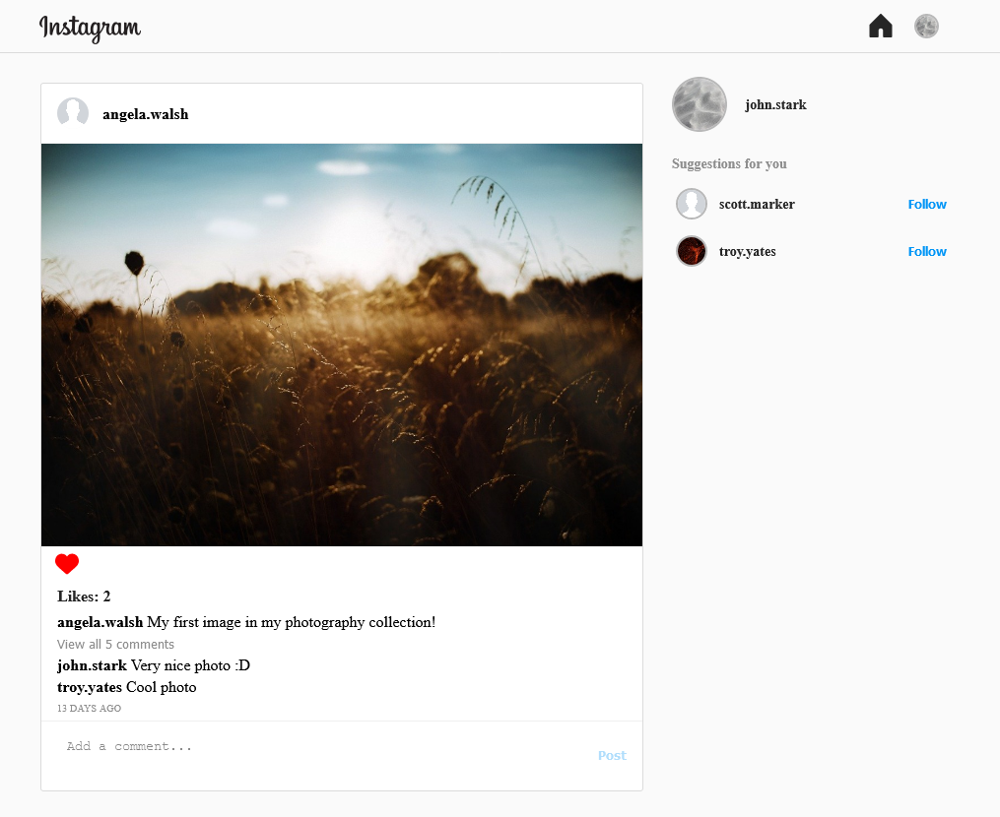
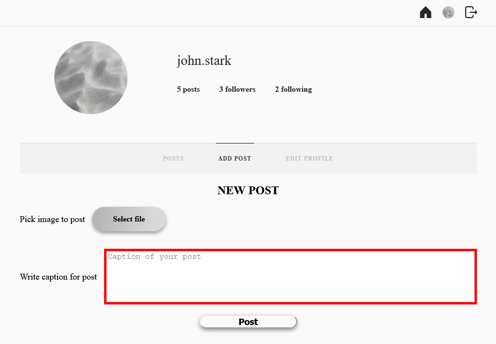

# Instagram-clone

> The project was inspired by Facebook's Instagram and was developed only for educational purposes. The application was built using React with Redux as the container for the global state, styles are applied with the help of styled components. It is integrated with serverless backend from firebase where it is also deployed.<br/> > **Live demo here https://instagram-clone-a6ece.web.app/.<br/>
> Test user credentials:**

- login: `one@test.com`
- password: `test1234`

## Table of Contents

- [Technologies Used](#technologies-used)
- [Features](#features)
- [Screenshots](#screenshots)
- [Setup](#setup)
- [Copyright claims](#copyright-claims)

## Technologies Used

- React - version 17.0.2
- Redux - version 4.1.2
- styled-components - version 5.3.3
- Firebase - version 9.6.1
- formik version 2.2.9 and yup version 0.32.11

## Features

The application allows a logged in user (managed by firebase authentication) to perform actions specified below.

### List of the features:

- Creation of the user's account (registration on firebase authentication), form build with the formik and yup libraries
- Addition of posts with image and description
- Following other users
- Liking and commenting followed users posts
- Changing account's information

## Screenshots




## Setup

### Requirements for development of the project:

- Node.js - version 16.13.1
- npm - version 7.6.3

1. Clone repository from github
2. Initialize project on the firebase platform and provide credentials to firebase application in React (link to documentation https://firebase.google.com/docs/web/setup).
3. Install all dependencies.

```bash
  npm install
```

4. Create a `.env` file and insert the following code. Replace values with credentials from firebase.

```javascript
REACT_APP_FIREBASE_API_KEY = "firebase-api-key";
REACT_APP_FIREBASE_AUTH_DOMAIN = "firebase-auth-domain";
REACT_APP_FIREBASE_PROJECT_ID = "firebase-project-id";
REACT_APP_FIREBASE_STORAGE_BUCKET = "firebase-storage-bucket";
REACT_APP_FIREBASE_MESSAGING_SENDER_ID = "firebase-messaging-sender-id";
REACT_APP_FIREBASE_APP_ID = "firebase-app-id";
REACT_APP_FIREBASE_MEASUREMENT_ID = "firebase-measurement-id";
USER_DEFAULT_ICON = "link-to-firebase-storage-with-image";
```

5. Start the server and application.

```bash
  npm start
```

## Copyright claims

Items used in this project belong to their creators/authors and are not claimed by author of this project and people that use it.
